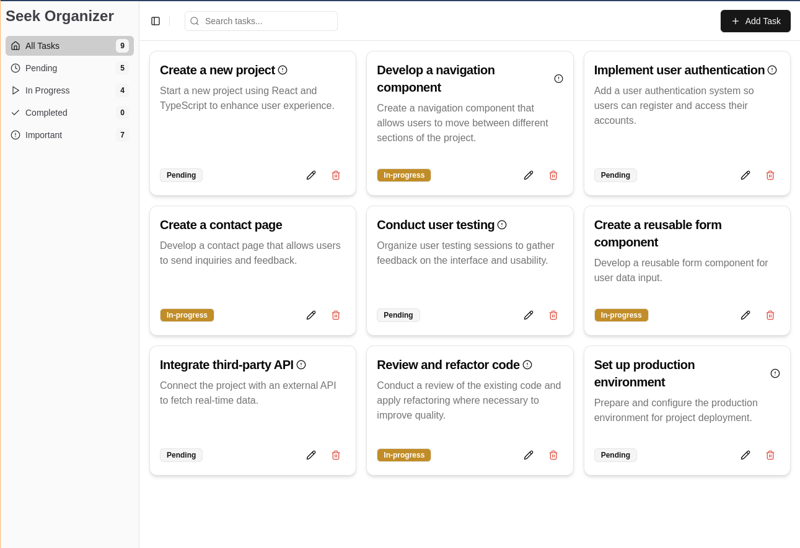

<div align="center">

# Seek Organizer



### _A Task Management Application_

A Next.js application for task management with mock data and in-memory storage.

</div>

## Prerequisites

- Node.js (v18 or higher)
- pnpm (preferred package manager)

## Installation

1. Clone the repository:

```bash
git clone <repository-url>
```

2. Install dependencies:

```bash
pnpm install
```

## Authentication

The application uses hardcoded credentials for demo purposes:

- Email: `email@email.com`
- Password: `password`

## Configuration

No additional configuration required. The project uses:

- Next.js 15.1
- TypeScript
- TailwindCSS
- Zod for validation
- Jest for testing

## Development

Start the development server:

```bash
pnpm dev
```

Access the application at:

http://localhost:3000

## Testing

Run tests:

```bash
pnpm test
```

Coverage report:

```bash
pnpm test:coverage
```

## Data Persistence

**Important Note**: This application currently uses:

- Mock data for initial tasks
- In-memory storage (changes are lost on page refresh)
- No database integration
- All CRUD operations are temporary

## Features

- User authentication (mock) with email and password
- User session management through JWT
- Task management (CRUD operations)
- Task filtering:
  - All Tasks
  - Pending
  - In Progress
  - Completed
- Search functionality
- Important task flagging
- Responsive design

## Project Structure

```
src/
  ├── app/              # Next.js app router pages
  ├── components/       # React components
  ├── core/            # Core business logic & mocks
  ├── hooks/           # Custom React hooks
  ├── lib/             # Utility functions
  ├── store/           # State management (in-memory)
  └── types/           # TypeScript type definitions
```

## Code Quality Tools

The project uses several tools to maintain code quality:

### Husky

Pre-commit hooks are configured using Husky to ensure code quality before each commit:

- Eslint for linting
- Type checking with TypeScript
- Unit tests with Jest

## Production Build

Create production build:

```bash
pnpm build
```
